# Monitoring CloudTrail logs using Wazuh SIEM

## Project Overview

So I have been tinkering with AWS for a while and I thought about setting up Wazuh to monitor CloudTrail Logs. This project is just about setting up Wazuh with CloudTrail, I'll be doing all the other cool things in later projects.

For this project we are going to be installing Wazuh SIEM on AWS to monitor CloudTrail logs.
The project will be divided into 5 sections:

1. Installing Wazuh
2. Setting up firewall rules to access the Wazuh EC2 instance
3. Configuring Amazon CloudTrail
4. Configuring IAM roles and policies, allowing Wazuh EC2 instance access to the CloudTrail logs
5. Configuring Wazuh to fetch logs from the CloudTrail S3 bucket

## Installing Wazuh

We will first go and launch an Amazon Linux EC2 instance for the Wazuh SIEM.

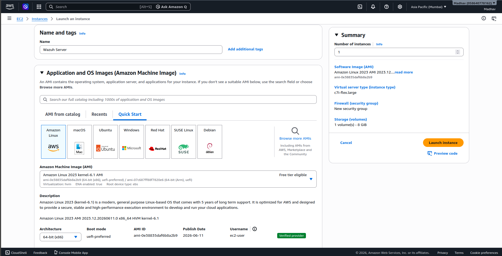

We will be choosing the `c7i-flex.large` instance type as it has enough resources to run Wazuh and it is eligible for the free tier. As Wazuh requires a bit more space we will be taking 30 GB of EBS storage.

After a few minutes we can ssh into the EC2 instance using the ssh private key we downloaded during the creation of it.

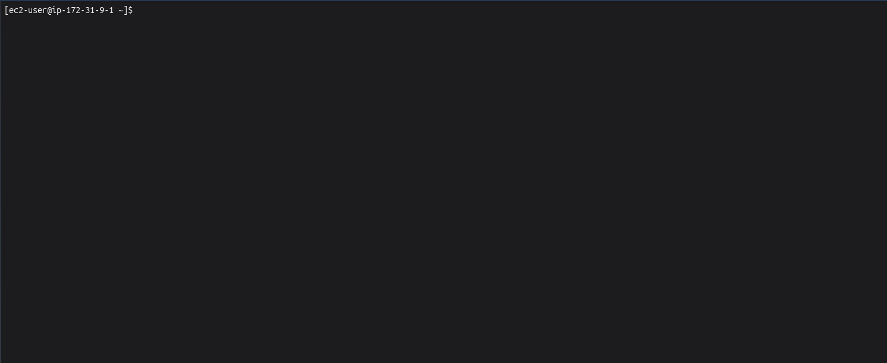

Now as we can see that we are successfully connected to the Wazuh EC2 instance via ssh, we can start installing Wazuh.

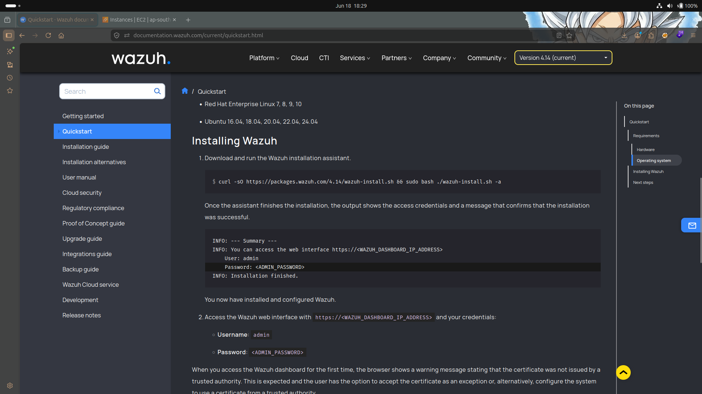

We can just paste this one command from the [Wazuh Quickstart](https://documentation.wazuh.com/current/quickstart.html) docs and wait for a few minutes (this could take a while!).

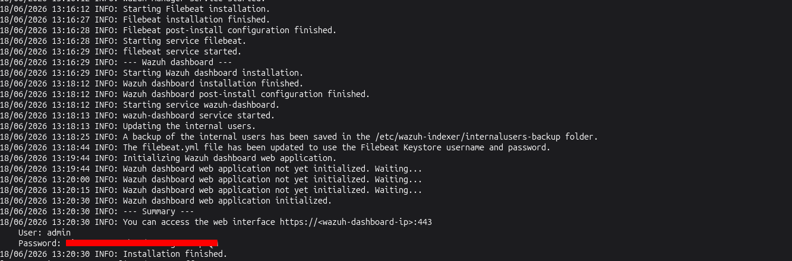

The Wazuh installation is successful!!! Just remember to give it ample storage or else the installation will fail. (Speaking from experience)

## Setting up firewall rules to access the Wazuh EC2 instance

I forgot to allow HTTPs access (Allow port 443) which will be used to access the Wazuh interface, we will be doing it now.

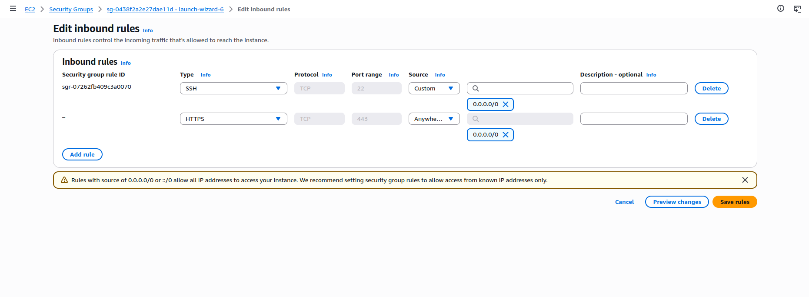

Although it is not best practice to allow access of the Wazuh web interface to anyone (Source 0.0.0.0/0) but I don't have a static IP due to which I have to set it this way. There are many ways to make it more secure like setting up a VPN tunnel between the EC2 instance and my home network but we will be simplifying it by just allowing public access for the sake of this project.

## Configuring Amazon CloudTrail

We will be creating a CloudTrail for Wazuh to monitor activities on my AWS account. The CloudTrail we will create will store the logs in an S3 bucket from which Wazuh will pull the logs from. Let's start setting it up!!!

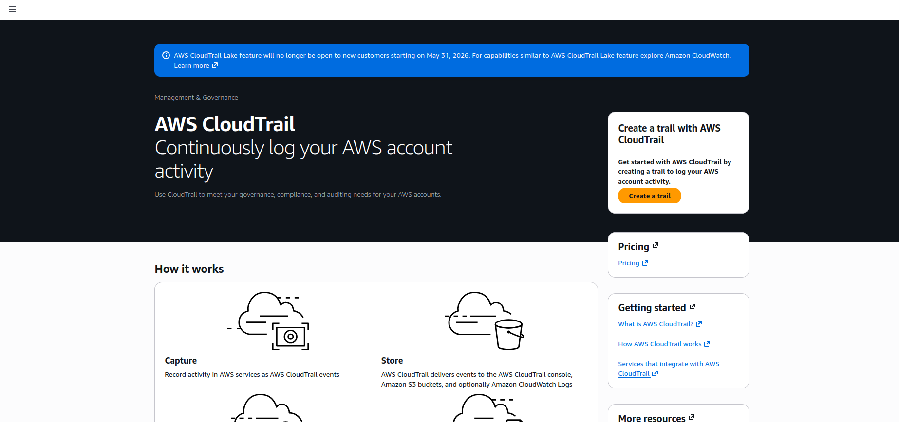

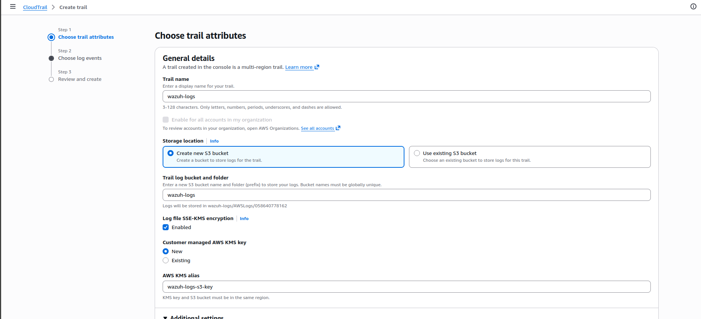

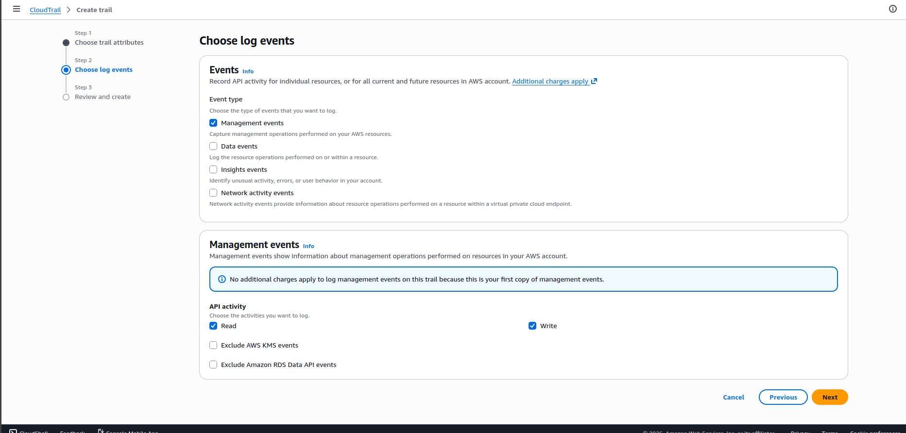

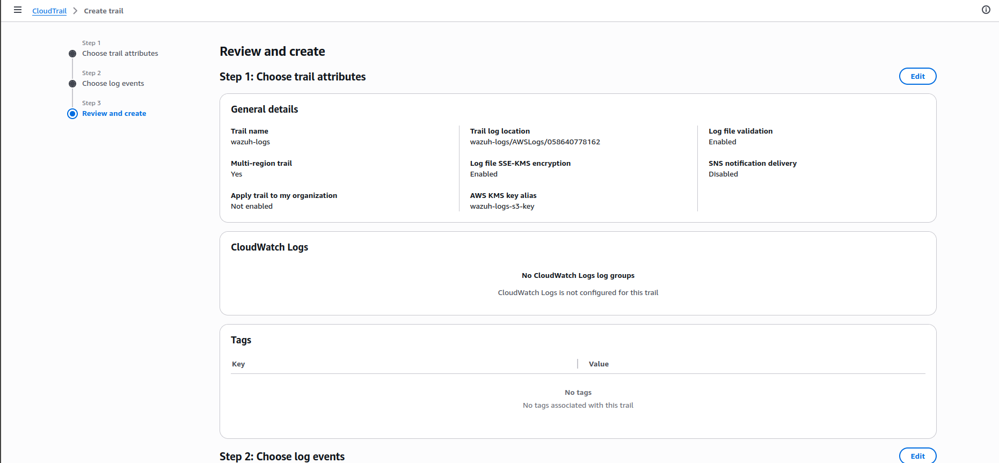

The name of the S3 bucket here was not available so I have changed it to a random one. Now let's move on to the next section!!!

## Configuring IAM roles and policies, allowing Wazuh EC2 instance access to the CloudTrail logs

Now for Wazuh to be able to view the logs we have to:

1. Create a custom IAM policy to only allow access to the CloudTrail S3 bucket
2. Attach the custom IAM policy to an IAM role.
3. Attach the IAM role to the Wazuh EC2 instance.

### Create a custom IAM policy to only allow access to the CloudTrail S3 bucket

To create a custom IAM policy for having `ReadOnly` access to the CloudTrail S3 bucket we will first look at the `AmazonS3ReadOnlyAccess` AWS managed policy.

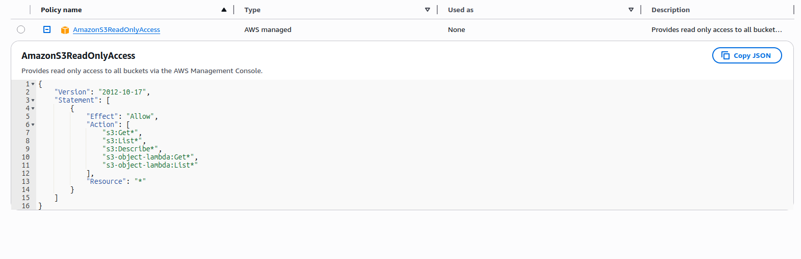

Now we can see that the `Resource` column has a value of `*` which means this policy allows `ReadOnly` access to all the existing S3 buckets. By just changing the value of the `Resource` column from `*` to the ARN (Amazon Resource Name) of the S3 bucket we will have a custom policy which allows `ReadOnly` access to our CloudTrail S3 bucket. So let's do it!!!

We Will copy the `AmazonS3ReadOnlyAccess` policy and create a custom policy.

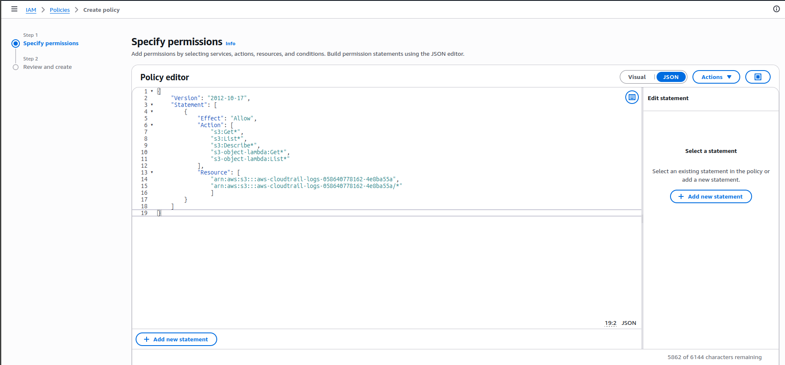

We added two resources to the policy:

1. `arn:aws:s3:::aws-cloudtrail-logs-058640778162-4e8ba55a`
2. `arn:aws:s3:::aws-cloudtrail-logs-058640778162-4e8ba55a/*`

The second one uses a wildcard (*) which allows access to all the objects inside the S3 bucket.

### Attach the custom IAM policy to an IAM role

Now we will create an IAM role for the Wazuh EC2 instance and attach our recently created custom IAM policy to it.

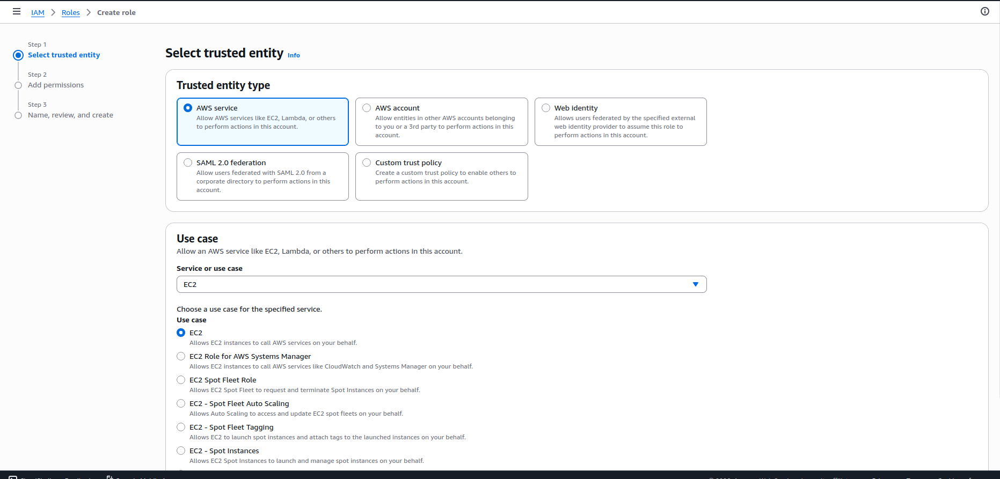

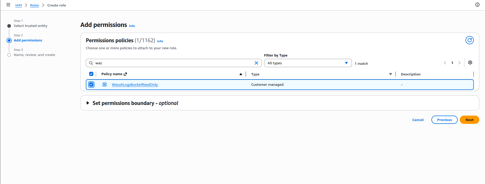

Now let's attach this role to the Wazuh EC2 instance.

### Attach the IAM role to the Wazuh EC2 instance

Let's go to the EC2 instance dashboard to attach our recently created IAM role to the Wazuh EC2 instance.

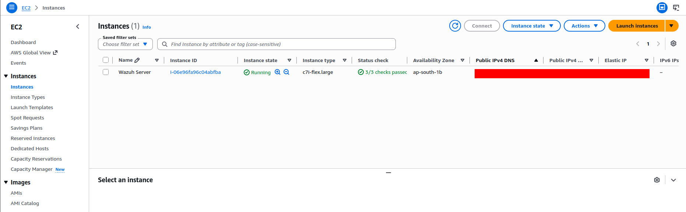

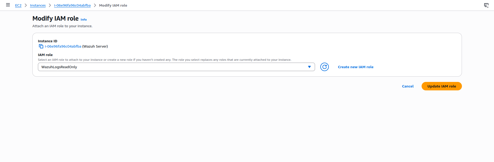

Now that we have attached the IAM role to the Wazuh EC2 instance, let's check if the EC2 instance can properly assume the IAM role and work as intended.

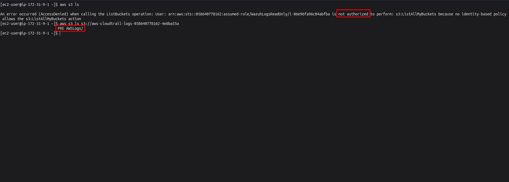

Now as we can see here in the AWS API call response that the user is not authorized to perform the `s3:ListAllMyBuckets` API call but we can successfully list the contents of the CloudTrail S3 bucket.

## Configuring Wazuh to fetch logs from the CloudTrail S3 bucket

Now we have to configure Wazuh to fetch logs from the CloudTrail S3 bucket we have setup.
We can do this by adding the following in the the `/var/ossec/etc/ossec.conf` config file.

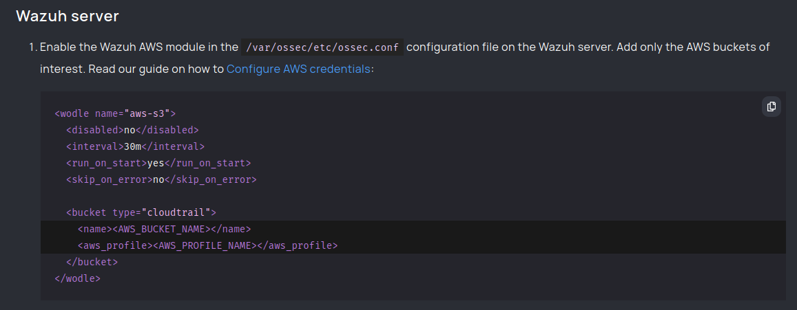

you can find this official documentation page of Wazuh [here](https://documentation.wazuh.com/current/proof-of-concept-guide/aws-infrastructure-monitoring.html). It has a lot of content on many other cool things such as `Network IDS Integration`, `Integration with VirtusTotal`, `File Integrity Monitoring`, and many more. We will cover these things in later projects, let's focus on this right now!!!

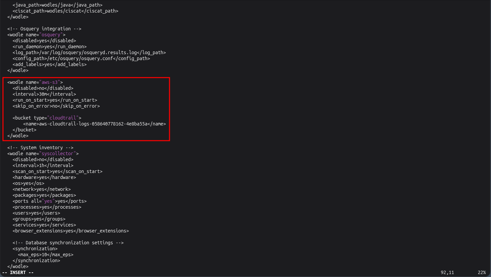

we can remove the `<aws_profile>` tag as we have already attached an IAM role to this EC2 instance. Wazuh automatically fetches the credentials from the AWS Instance Metadata Service (IMDS) which is basically just a service running on the AWS hypervisor which handles configuration details, state, and attached IAM roles of EC2 instances without needing to hard code the credentials. 

Now we just have to restart the `wazuh-manager` service and the configuration will be applied

Now that we have applied the configuration by restarting the `wazuh-manager` service we can now login to the Wazuh web console and see the AWS CloudTrail logs in it.

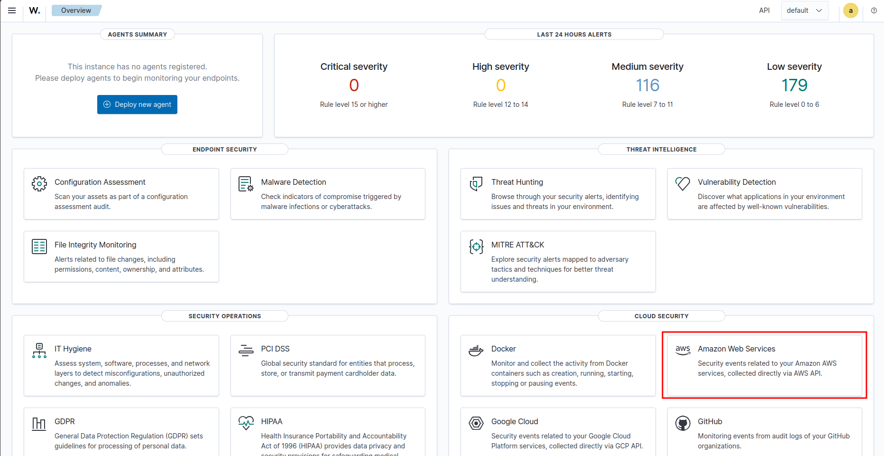

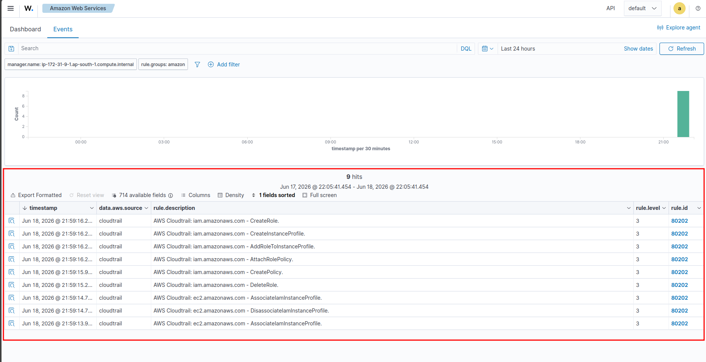

As you can see we have successfully integrated CloudTrail with Wazuh, we can see the things we did on my AWS account such as creating IAM roles & policies, Attaching the role to the Wazuh EC2 instance, and many more.

With that we have officially completed the project **Monitoring CloudTrail logs using Wazuh SIEM**

We can do a lot more than just see CloudTrail logs in Wazuh like:

1. Creating custom dashboards for viewing the top 5 most used AWS services used
2. Creating custom alerts to alert the admin of certain activities such as alerting when someone terminates an EC2 instance, or when someone creates an EC2 instance like the `m7i-flex` or any other instances which are very expensive and can increase the account bill.
3. Alerting when someone creates and attaches an IAM role with admin privileges.

These were just a few examples of what you can do by just integrating CloudTrail with Wazuh.
We can even Integrate **VPC flow logs**, **AWS WAF**, **Amazon ALB** with Wazuh to monitor network traffic, or integrate AWS GuardDuty for monitoring activities like unauthorized access, malware activity, crypto mining, and many more things!!!

These were just a few examples of what we can do to secure a company's AWS infrastructure using Wazuh SIEM.

Wazuh can also actively remove threats, isolate infected machines, etc. using it's **Active Response** module!!!